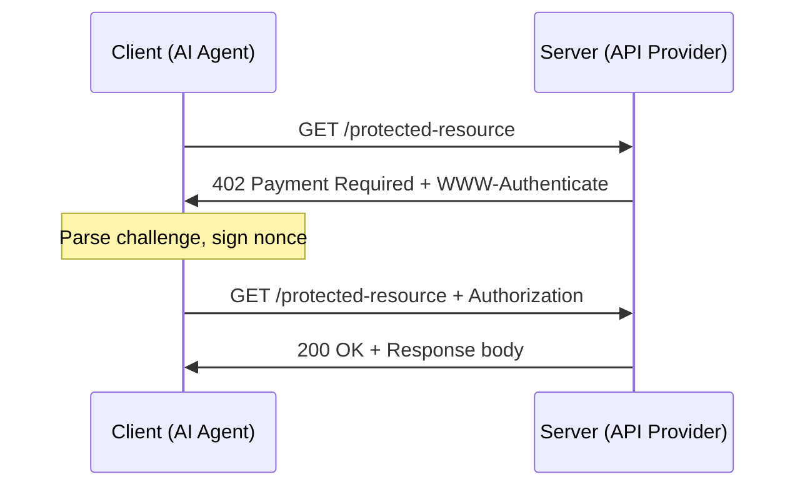

# INTMAX402 Protocol Specification

## Overview

INTMAX402 is an HTTP-based authentication and payment protocol that leverages INTMAX ZK L2 for lightweight, privacy-preserving identity verification and micropayments between AI agents and services.

## HTTP Flow



### Identity Mode Flow
1. Client sends request without credentials
2. Server responds with `401 Unauthorized` and `WWW-Authenticate` header
3. Client signs the nonce with their private key
4. Client retries with `Authorization` header containing address, nonce, and signature
5. Server verifies signature and responds with data

### Payment Mode Flow
1. Client sends request without credentials
2. Server responds with `402 Payment Required` and `WWW-Authenticate` header (includes amount, serverAddress, tokenAddress)
3. Client sends payment via INTMAX L2
4. Client retries with `Authorization` header containing address, nonce, signature, and txHash
5. Server verifies signature and payment, responds with data

## WWW-Authenticate Header

```
WWW-Authenticate: INTMAX402 realm="intmax402", nonce="<hex>", mode="identity|payment"
  [, serverAddress="<0x...>"]
  [, amount="<decimal>"]
  [, tokenAddress="<0x...>"]
  [, chainId="<number>"]
```

### Parameters

| Parameter | Required | Description |
|-----------|----------|-------------|
| realm | Yes | Always "intmax402" |
| nonce | Yes | HMAC-SHA256 time-windowed nonce (hex) |
| mode | Yes | "identity" or "payment" |
| serverAddress | Payment only | Ethereum address to receive payment |
| amount | Payment only | Payment amount in token decimals |
| tokenAddress | Payment only | ERC-20 token contract address |
| chainId | Payment only | Target chain ID |

## Authorization Header

```
Authorization: INTMAX402 address="<0x...>", nonce="<hex>", signature="<0x...>"
  [, txHash="<0x...>"]
```

### Parameters

| Parameter | Required | Description |
|-----------|----------|-------------|
| address | Yes | Client's Ethereum address |
| nonce | Yes | Nonce from the challenge |
| signature | Yes | ECDSA signature over the nonce |
| txHash | Payment only | INTMAX L2 transaction hash |

## Nonce Design

Nonces are generated using HMAC-SHA256 with time-windowed inputs:

```
nonce = HMAC-SHA256(secret, timeWindow + ":" + clientIP + ":" + requestPath)
```

- **Time window**: 30 seconds (floor(timestamp / 30000))
- **Verification**: Checks both current and previous time window
- **Properties**: Server-side only, no storage needed, replay-resistant

## Security Model

1. **No Node Required**: Verification is purely cryptographic, no blockchain node needed
2. **Privacy**: INTMAX ZK L2 provides zero-knowledge proof based privacy
3. **EVM Compatible**: Standard Ethereum addresses and ECDSA signatures
4. **Replay Protection**: Time-windowed nonces prevent replay attacks
5. **IP Binding**: Nonces are bound to client IP for additional security
6. **Lightweight**: sign ~4ms, verify ~6ms, total ~10ms overhead
